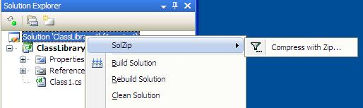

# Project Description

SolZip offers 3 ways to Compress(Zip) Visual Studio 2010 C# Solutions, C# Projects and Items. A commandline, One using Guidance Automation (GAX) and one using MME (mme.codeplex.com).

SolZip is written and conceived by Jesper Niedermann

# Introduction

Update: Version 1.3 finally I got around to releasing support for VS2010. It is in the 1.3 download. For VS2008 support you need to use the old 1.2 download.

Update: The original name for this tool was SolutionZipper but it has now been changed to SolZip since I stumbled upon another tool called SolutionZipper on the internet.

The concept of SolZip is simple - to enable Zip Compression of Visual Studio Solutions and Projects. This is not a unique idea, others have done it too. The uniqueness comes from the tools used to accomplish this, and the userinterfaces offered.

The simple and smart thing is that SolZip doesn't compress folders but actually reads the sln file and csproj files to infer which items are to be zipped. This also means that it doesn't need special logic to keep out things like the bin and obj folder or .svn folders from subversion.

So it is really not the compression part which makes SolZip extremely valuable. The ability to get all relevant files of the solution, excluding generated assemblies, PDB files, XML files, and other random debris, is something that every developer needs time and time again when they want to share their code with others. The ability to right click on a solution in Visual Studio, and make a Zip file of all relevant files makes this extremely easy.

In Release 1.1 it got the added option of removing Source Control bindings from solution (sln) and project files (csproj).

Currently SolZip offers zipping of C# Solutions and Projects in Visual Studio 2010 format. Other formats might work, but it would be pure luck, and not tested. It also supports setup projects and to some extent XNA content projects.

SolZip contains not one, but three(!) UI's to Zip Projects, each one offers its own advantages. All three uses the same basic functionality contained in SolZipBasis.dll. The actual compression is done with the excellent framework [SharpZipLib](http://www.icsharpcode.net/OpenSource/SharpZipLib/)

## SolZipMME

SolZipMME uses [MME](http://mme.codeplex.com) to enable Right click menus on Visual Studio Solutions, Projects and Items in the Solution Explorer. It is really the main offering of SolZip.
(The old version 1.2 for VS2008 uses [ManagedMenuExtensions](http://managedmenuextension.codeplex.com))

You can read more about [SolZipMME](SolZipMME) on its own page.

Screenshot:

## SolZip Commandline tool

SolZip.exe is a commandline tool for compressing solutions from a dos prompt. 

You can read more about [SolZip.exe](SolZip.exe) formerly known as [SunZip](SunZip) on its own page. 

Screenshot:

## SolZipGuidance

Offers the same Visual Studio Integration as SolZipMME but using Guidance Automation instead of Managed Menu Extensions. It in this sense it is not quite as slick as SolZipMME because you need to enable the guidance package for each solution you want to Compress.

The real point of SolZipGuidance is that you can take the recipe from the Sourcecode and use it in your own Software Factories. Don't forget to mention where you found it.

You can read more about [SolZipGuidance](SolZipGuidance) on its own page.

Screenshot:

## Behind the scenes or how it is done

Solutions are zipped by iterating over the lines of the sln file and finding all relevant solution items, projects and setup projects, and zipping each of them, and finally zipping the sln file itself.

Projects are zipped by iterating over the relevant nodes in the csproj file using LinqToXml and finding all relevant items and zipping each of them, and finally zipping the csproj file itself.

Setup projects are zipped by iterating over the folder of the vdproj file and zipping all files in the folder including the vdproj file itself.
