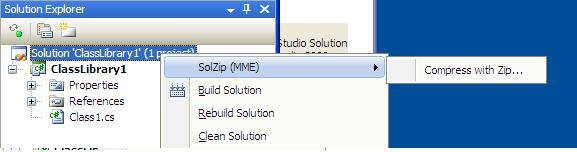
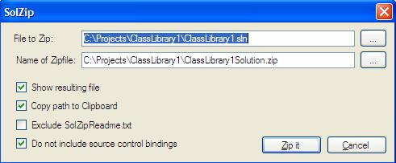

# SolZipMME

SolZipMME uses MME to enable Right click menus on Visual Studio Solutions, Projects and Items in the Solution Explorer. It is really the main offering of SolZip.

## Installation

To Install SolZipMME you need first need to install 2 items from [MME](http://mme.codeplex.com/) the order is this:

# Find and install [MME.msi](http://mme.codeplex.com/releases/view/70975) - to get the functionality for enabling right-click menus in VS2010.
# Find and install [SolZipMME.msi](http://solzip.codeplex.com/releases/view/72939) - to get the "Compress with Zip" menu on C# Solutions, Projects and Items in VS2010.

As a nice alternative you can install all 3 in one go with the [SolZipMMESingleInstall.msi](http://solzip.codeplex.com/releases/view/72939)

## Functionality

After the install(s) you get the following menu when you right-click a solution or project in Visual Studio:

If you click "Compress with Zip..." you get this window:

Where you can Zip the chosen object when "Zip it" is clicked.

The checkboxes have the following meaning. "Show resulting file" means that the Zip file will be opened after the Zipping is done. "Copy to clipboard" means the full path and filename of the file will be copied to the clipboard. And "Exclude SolZipReadme.txt" means that a very small text file promoting this site will not be included in the Zip archive.

## Behind the scenes or how it is done

Solutions are zipped by iterating over the lines of the sln file and finding all relevant solution items, projects and setup projects, and zipping each of them, and finally zipping the sln file itself.

Projects are zipped by iterating over the relevant nodes in the csproj file using LinqToXml and finding all relevant items and zipping each of them, and finally zipping the csproj file itself.

Setup projects are zipped by iterating over the folder of the vdproj file and zipping all files in the folder including the vdproj file itself.

## Other options

If you want a standalone command line tool you should go to the [SolZip.exe](SolZip.exe) tool of SolZip.

If you want a recipe for your software factory you should go to the [SolZipGuidance](SolZipGuidance) tool of SolZip.